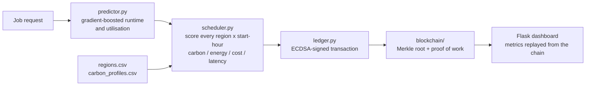

# GreenScale Cloud 2.0


**AI-driven carbon-aware multi-cloud resource scheduling with blockchain-based secure
resource allocation.**

Cloud Computing mini-project — B.Tech CSE (Artificial Intelligence),
Amrita Vishwa Vidyapeetham, Coimbatore.

Team of four: **Sai Reddy A.** (scheduler core + experiment harness), Rohit Vardhan M., Jithin Reddy K., Sai Vandith — see [who did what](#what-each-of-us-did).

---

## What this is

Our base paper is Biswas, Jahan, Saha and Samsuddoha, *"A succinct state-of-the-art
survey on green cloud computing: challenges, strategies, and future directions"*
(Sustainable Computing: Informatics and Systems 44, 2024, 101036). It surveys how the
field reduces energy and carbon in cloud data centres, and it is very good at that —
but every framework it catalogues shares one blind spot. **None of them records *why* a
placement decision was made in a way anyone else can check.**

That matters the moment sustainability stops being a slide and starts being a claim. If
a hospital tells its regulator "we cut our cloud emissions by 60% this year", the number
comes from a log file the provider owns and can rewrite. There is no way for the
customer, the auditor, or the regulator to tell a real reduction from an edited one.

GreenScale Cloud 2.0 keeps the survey's green objective and adds the missing half:

1. **An AI scheduler** that predicts how a job will behave, then picks the region *and*
   the start hour that minimise a weighted combination of carbon, energy, cost and
   latency, subject to hard constraints (data residency, latency budget, capacity).
2. **A blockchain ledger** in which every allocation, migration, carbon saving and SLA
   check is an ECDSA-signed transaction inside a Merkle-summarised, proof-of-work block.
   Edit one number in the history and validation fails, pointing at the exact record.

## Architecture



## Headline result

400-job trace, seed 42, default weight profile:

| Policy | kg CO₂ | CO₂ saved | Cost | Cost change | Avg delay | SLA |
| --- | ---: | ---: | ---: | ---: | ---: | ---: |
| **greenscale** (ours) | **18.38** | **72.5%** | $374.29 | −2.3% | 0.42 h | 100% |
| carbon_only | 17.33 | 74.0% | $375.40 | −2.0% | 2.41 h | 100% |
| cost_only | 41.98 | 37.1% | $323.82 | −15.4% | 0.00 h | 100% |
| home_region *(baseline)* | 66.69 | — | $382.95 | — | 0.00 h | 100% |
| round_robin | 45.21 | 32.2% | $364.80 | −4.7% | 0.00 h | 100% |

The interesting row is not ours, it is `carbon_only`. Chasing the last 1.6 percentage
points of carbon costs **5.7× more average delay per job** (2.41 h against 0.42 h). A
pure carbon policy looks best in a table and is unshippable to a real customer. The
multi-objective score is what makes the saving deliverable.

Baseline is `home_region` — nearest region, start immediately — because that is what an
Indian small business actually gets today when nobody schedules for them.

Ledger overhead: **2.7 ms per transaction** including signing and mining at difficulty 3.
Sustainability accounting is not on the hot path of a request, so this is comfortably
affordable.

Reproduce all of it:

```bash
python scripts/run_experiment.py
```

## Running it

```bash
pip install -r requirements.txt
python scripts/train_model.py
python run.py
```

Then open <http://localhost:5000>. On Windows, `run.bat` does all four steps.

With Docker:

```bash
docker compose up --build
```

The tests need no network, no keys and no trained model:

```bash
python -m pytest tests -q
```

## The four pages

- **Dashboard** — KPIs, the 24-hour grid-carbon curves for all nine regions, where jobs
  landed, per-region and per-tenant accounting. Every figure is recomputed by replaying
  the chain; there is no separate totals table.
- **Schedule a job** — submit one job, see every (region, start-hour) candidate scored,
  see which block the decision was written into. Sliders change the objective weights.
- **Policy comparison** — run the same trace through all five policies.
- **Ledger** — block explorer with full transaction payloads, a live validity check, and
  a tamper test that forges a record on an in-memory copy and shows validation failing.

## Layout

```
greenscale/
  config.py        every tunable constant, with the reason next to it
  regions.py       region catalogue + carbon intensity model (CSV-driven)
  workload.py      Task model and the reproducible trace generator
  energy.py        power -> energy -> carbon -> cost, one place to argue with
  predictor.py     the AI: gradient-boosted runtime/utilisation prediction
  scheduler.py     multi-objective scoring, constraints, the five policies
  migration.py     should a running VM move to a greener region right now?
  ledger.py        scheduling decisions -> signed transactions; replay -> metrics
  simulator.py     experiment harness and ground-truth generator
  app.py           Flask routes (thin: no decisions are made here)
  blockchain/
    merkle.py      Merkle tree, proofs, verification
    crypto.py      ECDSA P-256 signing and verification
    block.py       block header, hashing, proof of work
    chain.py       append, mine, validate, persist
web/               templates + one CSS file + one JS file, no framework
data/              regions.csv, carbon_profiles.csv, and the ledger at runtime
tests/             72 tests, no network or keys required
scripts/           train_model.py, run_experiment.py (Python)
docs/              ARCHITECTURE.md, DEPLOYMENT.md
```

## Honest limitations

Stated up front rather than left to be discovered.

- **Carbon data is a static snapshot**, not a live feed. `data/regions.csv` holds
  published grid averages and `data/carbon_profiles.csv` holds a representative daily
  shape. Swapping in Electricity Maps or WattTime means rewriting one method,
  `CarbonModel.intensity`, and nothing else.
- **The workload trace is generated, not measured.** We had no access to a production
  cluster trace, so `workload.generate_trace` samples from distributions shaped after
  the public Google cluster trace. The scheduler and predictor run unchanged on real
  rows; only the source of the rows differs.
- **Placement is simulated.** No VM is really started. This is a scheduling and
  accounting study, and every energy figure comes from the documented model in
  `energy.py` rather than from a wattmeter.
- **The chain has one writer.** Proof of work with a single scheduler node is
  deliberate overkill; it buys us the property that rewriting history is expensive, but
  it is not Byzantine fault tolerance. Multiple independent schedulers would need real
  consensus — Hyperledger Fabric or similar. That is future work, not something we are
  pretending to have.
- **Region prices and latencies are representative figures**, not live billing data.

## What each of us did

- **Sai Reddy A.** — scheduler core: candidate generation, min-max normalisation,
  weighted scoring, constraint filtering, the five policies. Experiment harness.
- **Rohit Vardhan M.** — blockchain layer: Merkle tree and proofs, block hashing and
  proof of work, chain validation, ECDSA signing, persistence.
- **Jithin Reddy K.** — AI predictor: feature engineering, gradient-boosted models,
  the training script and its comparison against the closed-form baseline. Energy,
  carbon and cost model.
- **Sai Vandith** — Flask API and the four dashboard pages, charts, region and carbon
  datasets, Docker and deployment configuration.

Tests were written by whoever owned the module. All four of us reviewed the final
result tables together before the numbers went into the slides.

## Tech stack

Python · Flask · scikit-learn (gradient boosting) · cryptography (ECDSA P-256) · gunicorn / waitress · Docker · pytest
